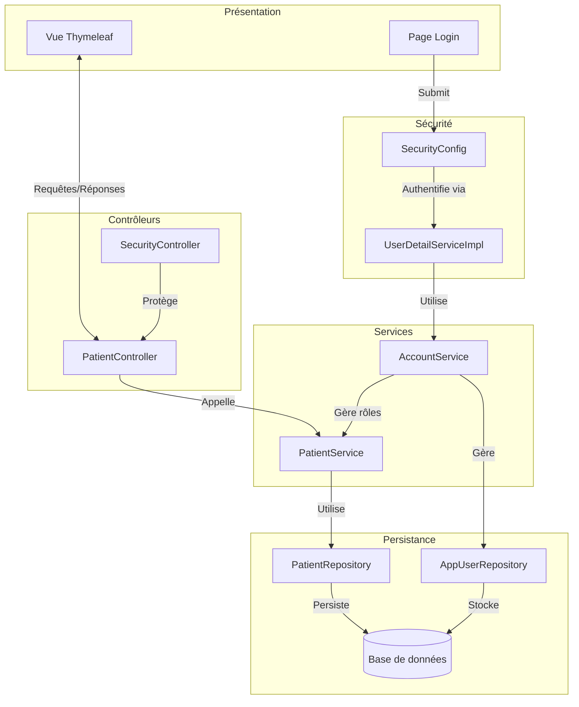

# Application de Gestion Hospitalière - Rapport Technique


## Description du Projet
Application web complète pour la gestion des patients dans un environnement hospitalier, développée avec :
- Architecture Spring MVC (Modèle-Vue-Contrôleur)
- Templating Thymeleaf
- Persistance des données avec Spring Data JPA
- Système de sécurité Spring Security

## Fonctionnalités Principales

### 🧑‍⚕️ Gestion des Patients
- **CRUD complet** (Création, Lecture, Mise à jour, Suppression)
- **fonctionnalités de recherche** 
- **Pagination** des résultats
- **Validation** des formulaires

### 🔒 Sécurité
- Authentification sécurisée
- Gestion des rôles (Admin/Utilisateur)
- Protection contre les attaques CSRF

### Interface Utilisateur
- Interface responsive avec **Bootstrap 5**
- Templates cohérents avec **Thymeleaf**
- **Bootstrap Icons** pour les pictogrammes

## 🛠 Stack Technique

### Backend
| Technologie | Version | Usage |
|------------|---------|-------|
| Java | 17 | Langage principal |
| Spring Boot | 3.5.0 | Framework principal |
| Spring Data JPA | 3.5.0 | Persistance des données |
| Spring Security | 6.1 | Gestion des accès (authentification et autorisations) |
| Hibernate | (via Spring) | ORM |

### Frontend
| Technologie | Version | Usage |
|------------|---------|-------|
| moteur de templates Thymeleaf | 3.1 | Templating côté serveur |
| Bootstrap | 5.3 | Framework CSS |
| Bootstrap Icons | 1.11 | Bibliothèque d'icônes |
| jQuery | 3.6 | Manipulation du DOM |

### Bases de Données
| Technologie | Usage | Accès |
|------------|-------|-------|
| H2 | In Memory Database | http://localhost:8084/h2-console |
| MySQL | Locale | http://localhost |

## 📦 Dépendances Maven

### Backend
| Dépendance | Version | Description |
|------------|---------|-------------|
| `spring-boot-starter-data-jpa` | 3.5.0 | Persistance JPA + Hibernate |
| `spring-boot-starter-security` | 3.5.0 | Authentification & Autorisation | 
| `spring-boot-starter-validation` | 3.5.0 | Validation des formulaires |
| `spring-boot-starter-web` | 3.5.0 | Développement web MVC |
| `lombok` | 1.18.28 | Réduction du code boilerplate | 

### Frontend
| Dépendance | Version | Description |
|------------|---------|-------------|
| `spring-boot-starter-thymeleaf` | 3.5.0 | Templating côté serveur |
| `thymeleaf-layout-dialect` | 3.2.0 | Gestion des layouts |
| `thymeleaf-extras-springsecurity6` | 3.1.2 | Intégration Thymeleaf + Security | 
| `bootstrap` (WebJars) | 5.3.5 | Framework CSS |
| `bootstrap-icons` | 1.11.1 | Bibliothèque d'icônes |
| `jquery` (WebJars) | 3.6.3 | Manipulation DOM 

### Base de Données
| Dépendance | Version | Scope |
|------------|---------|-------|
| `h2` | 2.2.220 | runtime |
| `mysql-connector-j` | 8.0.33 | runtime |

### Développement
| Dépendance | Version | Scope |
|------------|---------|-------|
| `spring-boot-devtools` | 3.5.0 | optional | 
| `spring-boot-starter-test` | 3.5.0 | test | 

```xml
<dependencies>
    <!-- Spring Boot Starters -->
    <dependency>
        <groupId>org.springframework.boot</groupId>
        <artifactId>spring-boot-starter-data-jpa</artifactId>
    </dependency>
    <dependency>
        <groupId>org.springframework.boot</groupId>
        <artifactId>spring-boot-starter-thymeleaf</artifactId>
    </dependency>
    <dependency>
        <groupId>org.springframework.boot</groupId>
        <artifactId>spring-boot-starter-web</artifactId>
    </dependency>
    
    <!-- Sécurité -->
    <dependency>
        <groupId>org.springframework.boot</groupId>
        <artifactId>spring-boot-starter-security</artifactId>
    </dependency>
    <dependency>
        <groupId>org.thymeleaf.extras</groupId>
        <artifactId>thymeleaf-extras-springsecurity6</artifactId>
    </dependency>

    <!-- Frontend -->
    <dependency>
        <groupId>org.webjars</groupId>
        <artifactId>bootstrap</artifactId>
        <version>5.3.5</version>
    </dependency>
    <dependency>
        <groupId>org.webjars.npm</groupId>
        <artifactId>bootstrap-icons</artifactId>
        <version>1.11.1</version>
    </dependency>
</dependencies>
```

## 🧱 Structure des Packages


## Architecture globale de l'application


    
#### 🗂 Package entities

  Entité JPA représentant un patient avec :
  - `@Id` + `@GeneratedValue` pour l'identifiant
  - Validation des champs (`@NotEmpty`, `@Size`)
  - Annotations Lombok pour réduire le code boilerplate :
      - @Data : Génère getters/setters
      - @Builder : Permet la construction fluide
      - @NoArgsConstructor : Constructeur par défaut
      - @AllArgsConstructor : Constructeur complet
 
  

#### 🗂 Package repository

  

    Fonctionnalités clés :
    - Hérite des opérations CRUD de base via JpaRepository
    - Deux types de requêtes :
      - Méthode dérivée : Génération auto par Spring (findByNomContains)
      - Requête custom : Contrôle précis via @Query
    Retourne des résultats paginés (Page<T> + Pageable)

#### 🔐 Package security - Gestion d'Authentification

##### 🏷️ Entités de Sécurité


Fonctionnalités :
- Gestion des rôles et utilisateurs
- Relation ManyToMany entre utilisateurs et rôles
- Chargement immédiat des rôles (EAGER)

##### 📚 Repositories


Avantages :
- CRUD automatique via JpaRepository
- Recherche d'utilisateur par username

##### 🛠️ Services


```java
@Service
@Transactional
@AllArgsConstructor
public class AccountServiceImpl implements AccountService {
    private final AppUserRepository userRepository;
    private final AppRoleRepository roleRepository;
    private final PasswordEncoder passwordEncoder;

    @Override
    public AppUser addNewUser(String username, String password, String email, String confirmPassword) {
        if (userRepository.findByUsername(username) != null) 
            throw new RuntimeException("User already exists");
        if (!password.equals(confirmPassword))
            throw new RuntimeException("Passwords do not match");
            
        return userRepository.save(
            AppUser.builder()
                .userId(UUID.randomUUID().toString())
                .username(username)
                .password(passwordEncoder.encode(password))
                .email(email)
                .build()
        );
    }

    @Override
    public AppRole addNewRole(String role) {
        if (roleRepository.findById(role).isPresent())
            throw new RuntimeException("Role already exists");
            
        return roleRepository.save(
            AppRole.builder().role(role).build()
        );
    }

    @Override
    public void addRoleToUser(String username, String role) {
        AppUser user = userRepository.findByUsername(username);
        AppRole appRole = roleRepository.findById(role).orElseThrow();
        user.getRoles().add(appRole);
    }

    @Override
    public AppUser loadUserByUsername(String username) {
        return userRepository.findByUsername(username);
    }
}
```


Fonctionnalités clés :
- Gestion transactionnelle
- Hachage des mots de passe
- Conversion pour Spring Security

## ⚙️ Configuration

``` java
@Configuration
@EnableWebSecurity
@EnableMethodSecurity(prePostEnabled = true)
@AllArgsConstructor
public class SecurityConfig {
    private final UserDetailServiceImpl userDetailServiceImpl;

    @Bean
    public SecurityFilterChain securityFilterChain(HttpSecurity http) throws Exception {
        return http
                .formLogin(form -> form
                        .loginPage("/login")
                        .defaultSuccessUrl("/user/index")
                        .permitAll()
                )
                .rememberMe(remember -> remember
                        .key("unique-secure-key")
                        .tokenValiditySeconds(1209600) // 14 jours
                        .userDetailsService(userDetailServiceImpl)
                )
                .authorizeHttpRequests(auth -> auth
                        .requestMatchers("/webjars/**").permitAll()
                        .requestMatchers("/admin/**").hasRole("ADMIN")
                        .requestMatchers("/user/**").hasRole("USER")
                        .anyRequest().authenticated()
                )
                .exceptionHandling(exception -> 
                    exception.accessDeniedPage("/notAuthorized")
                )
                .build();
    }

    @Bean
    public PasswordEncoder passwordEncoder() {
        return new BCryptPasswordEncoder();
    }
}
```
Options d'authentification :
1. InMemory (pour tests)
2. JDBC (base de données)
3. Personnalisée (via UserDetailServiceImpl)

Fonctionnalités activées :
- Formulaire de login personnalisé
- Protection CSRF
- Remember-me (14 jours)
- Contrôle d'accès par rôles

Cela offre une sécurité complète tout en restant flexible pour différentes méthodes d'authentification.


#### 🌐 Package web - Contrôleurs Principaux

##### 🏥 PatientController 

```java
@Controller
@AllArgsConstructor
public class PatientController {

    @Autowired
    private PatientRepository patientRepository;

    @GetMapping("/user/index")
    public String index(Model model,
                        @RequestParam(name = "page", defaultValue = "0") int page ,
                        @RequestParam(name = "size", defaultValue = "4") int size,
                        @RequestParam(name = "keyword", defaultValue = "") String kw ){
        // @RequestParam(name = "page"): on lui dit va chercher un paramètre qui s'appel page
        // sans faire la pagination
        //List<Patient> patientList= patientRepository.findAll();
        // integrer la pagination
        Page<Patient> pagePatients= patientRepository.findByNomContains(kw, PageRequest.of(page, size));
        // en utilisant getContent, le contenu de la page est retourné, à ce point là est la liste des patients
        model.addAttribute("Listpatients", pagePatients.getContent());
        // stocker le nombre de pages
        model.addAttribute("pages",new int[pagePatients.getTotalPages()]);
        // stocker la page courante pour la colorier
        model.addAttribute("currentPage",page);
        // stocker la valeur de keyword pour l 'affichier après
        model.addAttribute("keyword",kw);
        return "Patients";
    }
    // supprimer les patients
    @GetMapping("/admin/delete")
    @PreAuthorize("hasRole('ROLE_ADMIN')")
    public String delete(@RequestParam(name="id") Long id,
                         @RequestParam(name = "keyword", defaultValue = "") String keyword,
                         @RequestParam(name = "page", defaultValue = "0") int page){
        patientRepository.deleteById(id);
        return "redirect:/user/index?page="+page+"&keyword="+keyword;
    }
    //
    @GetMapping("/")
    public String home(){
        return "redirect:/user/index";
    }
    @GetMapping("/patients")
    public List<Patient> listPatients(){
        return patientRepository.findAll();
    }

    @GetMapping("/formPatients")
    @PreAuthorize("hasRole('ROLE_ADMIN')")
    public String formPatient(Model model){
        model.addAttribute("patient", new Patient());
        return "formPatients";
    }

    @PostMapping("/admin/save")
    @PreAuthorize("hasRole('ROLE_ADMIN')")
    public String save(Model model, @Valid Patient patient, BindingResult bindingResult,
                       @RequestParam(name = "keyword", defaultValue = "") String keyword,
                       @RequestParam(name = "page", defaultValue = "0") int page){
        if(bindingResult.hasErrors()){
            return "formPatients";
        }else{
            model.addAttribute("keyword", keyword);
            model.addAttribute("page", page);
            patientRepository.save(patient);
            return "redirect:/user/index?page="+page+"&keyword="+keyword;
        }
    }
    @GetMapping("/admin/editPatient")
    @PreAuthorize("hasRole('ROLE_ADMIN')")
    public String editPatient(Model model, Long id, String keyword, int page){
        Patient patient = patientRepository.findById(id).orElse(null);
        if(patient == null)throw new RuntimeException("Patient introuvable");
        model.addAttribute("patient", patient);
        model.addAttribute("keyword", keyword);
        model.addAttribute("page", page);
        return "editPatients";
    }
}
```

##### 🔐 SecurityController


###### Sécurité
- 🔒 2 modes d'authentification:
  - InMemory
  - JDBC 
- 👥 Gestion des rôles

###### 📁 Templates

| Fichier              | Description                  |
|----------------------|------------------------------|
| `patients.html`      | Liste des patients           |
| `formPatients.html`  | Formulaire d'ajout           |
| `editPatients.html`  | Formulaire d'édition         |
| `login.html`         | Page de connexion            |
| `notAuthorized.html` | Page d'erreur 403            |
| `template1.html`     | Template/Layout de base      |

## ⚙️ Fichiers de configuration
- application.properties :
  
  

- schema.sql : Script d'initialisation de la base
  ```sql
  create table if not exists users(username varchar(50) not null primary key,password varchar(500) not null,enabled boolean not null);
  create table if not exists authorities (username varchar(50) not null,authority varchar(50) not null,constraint fk_authorities_users foreign key(username) references users(username));
  create unique index IF NOT EXISTS ix_auth_username on authorities (username,authority);
  ```

## 🚀 Classe Principale

``` java
@SpringBootApplication
public class ThymeleafSpringDataJpaMvcApplication {
    @Autowired
    private PatientRepository patientRepository;
    public static void main(String[] args) {
        SpringApplication.run(ThymeleafSpringDataJpaMvcApplication.class, args);
    }

    @Bean
    CommandLineRunner start(PatientRepository patientRepository) {
        return args -> {
            // trois façons pour insérer des patients
            // 1 ere méthode
            Patient patient = new Patient();
            patient.setId(null);
            patient.setNom("user");
            patient.setDateNaissance(new Date());
            patient.setMalade(false);
            patient.setScore(23);
            //patientRepository.save(patient);

            // 2 eme méthode
            Patient patient2 = new Patient(null,"utilisateur",new Date(),false, 123);
            //patientRepository.save(patient2);

            // 3 eme méthode : en utilisant builder
            Patient patient3= Patient.builder()
                    .nom("user")
                    .dateNaissance(new Date())
                    .score(56)
                    .malade(true)
                    .build();
            //patientRepository.save(patient3);

            patientRepository.save(new Patient(null,"Mohammed",new Date(),false,134));
            patientRepository.save(new Patient(null, "Yuki", new Date(), false, 111));
            patientRepository.save(new Patient(null, "Zhang", new Date(), true, 222));
            patientRepository.save(new Patient(null, "Amina", new Date(), false, 333));
            patientRepository.save(new Patient(null, "Giovanni", new Date(), true, 444));
            patientRepository.save(new Patient(null, "Olga", new Date(), false, 555));
            patientRepository.save(new Patient(null, "Fatima", new Date(), false, 240));
            patientRepository.save(new Patient(null, "Amina", new Date(), true, 170));
            patientRepository.save(new Patient(null, "Khadija", new Date(), false, 390));
            patientRepository.save(new Patient(null, "Noura", new Date(), true, 125));
            patientRepository.save(new Patient(null, "Sara", new Date(), false, 290));
            patientRepository.save(new Patient(null, "Lina", new Date(), true, 200));
            patientRepository.save(new Patient(null, "Yasmin", new Date(), false, 360));
            patientRepository.save(new Patient(null, "Salma", new Date(), true, 230));
            patientRepository.save(new Patient(null, "Zineb", new Date(), false, 190));
            patientRepository.save(new Patient(null, "Leila", new Date(), true, 310));
            patientRepository.findAll().forEach(p ->{
                System.out.println(p.getNom());
            });
        };
    }

    @Bean
    PasswordEncoder passwordEncoder(){
        return new BCryptPasswordEncoder();
    }

    //@Bean
    CommandLineRunner commandLineRunner(JdbcUserDetailsManager jdbcUserDetailsManager){
        PasswordEncoder passwordEncoder = passwordEncoder();
        return args ->{

            if(!jdbcUserDetailsManager.userExists("user1")){
                jdbcUserDetailsManager.createUser(User.withUsername("user1").password(passwordEncoder.encode("1234")).roles("USER").build());
            }
            if(!jdbcUserDetailsManager.userExists("user2")){
                jdbcUserDetailsManager.createUser(User.withUsername("user2").password(passwordEncoder.encode("1234")).roles("USER").build());
            }
            if(!jdbcUserDetailsManager.userExists("admin")){
                jdbcUserDetailsManager.createUser(User.withUsername("admin").password(passwordEncoder.encode("1234")).roles("USER","ADMIN").build());
            }

        };
    }

    @Bean
    CommandLineRunner commandLineRunnerUserDetails(AccountService accountService){
        return args ->{

            accountService.addNewRole("USER");
            accountService.addNewRole("ADMIN");
            accountService.addNewUser("user1", "1234", "user1@gmail.com", "1234");
            accountService.addNewUser("user2", "1234", "user2@gmail.com", "1234");
            accountService.addNewUser("admin", "1234", "admin@gmail.com", "1234");

            accountService.addRoleToUser("user1", "USER");
            accountService.addRoleToUser("user2", "USER");
            accountService.addRoleToUser("admin", "USER");
            accountService.addRoleToUser("admin", "ADMIN");
        };
    }

}
```

## Base de données :
  


### Tables :

- app_role :
      

    
- app_user :
      

    
- app_user_role :
    

    
- Patients :
      

    
- Users :
      

    
- Authorities :
      


## Résultats :
- Page Login :
  
- Page Accueil (pour Admin)
  
- Page Acceuil (pour User)
  
- Page Modification
  
- Page Modification (Après la modification)
  
- Page Suppression: Je supprime Leila avec id=16
  
- Page Suppression: Après la suppression
  
- Page Recherche 🔍:
  
- Validation du formulaire:
  
- Page Ajouter:
  
- Page Ajouter: Après l'ajout
  

## 🏁 Conclusion

Ce projet complet démontre la puissance de **Spring Boot** pour développer des applications web sécurisées et efficaces. À travers cette application hospitalière, j'ai pu implémenté :

- **Architecture MVC propre** avec séparation claire des couches (Controller/Service/Repository)
- **Sécurité robuste** combinant :
  - Authentification personnalisée (JDBC + InMemory)
  - Gestion fine des rôles (`@PreAuthorize`)
  - Protection contre les injections SQL
- **Expérience utilisateur optimale** :
  - Pagination intelligente
  - Recherche dynamique
  - Validation des formulaires
- **Productivité développeur** :
  - Réduction de code avec Lombok
  - Configuration simplifiée (Spring Boot Auto-configuration)
  - Console H2 pour le débogage

## Auteur : 
Safae ERAJI
