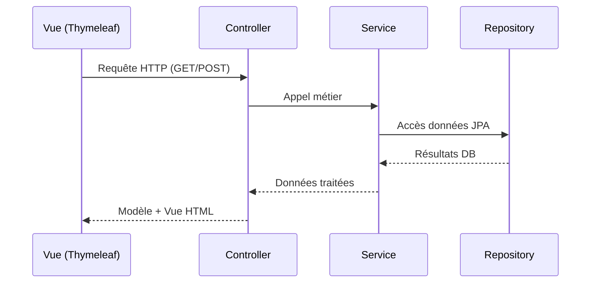
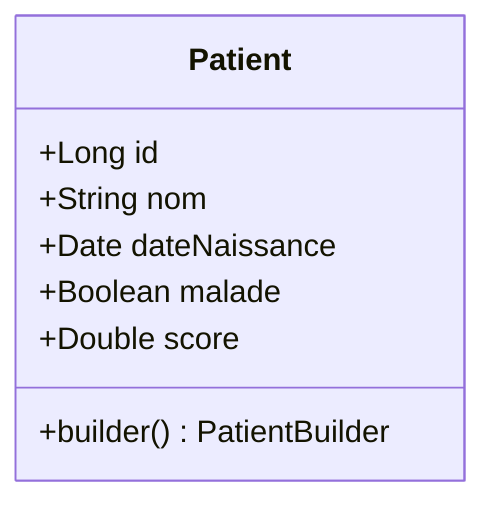
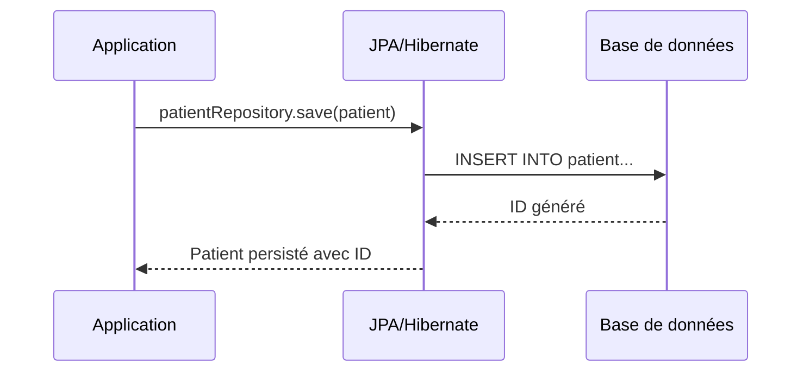
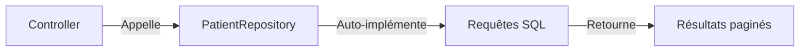

# Rapport - Application de Gestion des Patients

## Description du Projet
Application Web JEE basée sur Spring MVC (L'architecture web Modèle-Vue-Contrôleur), Thymeleaf et Spring Data JPA pour la gestion des patients dans un hôpital.

Elle doit permettre de :
- Gérer les patients (CRUD complet).
- Implémenter une pagination des résultats.
- Ajouter des fonctionnalités de recherche.
- Sécuriser l'accès aux différentes fonctionnalités.
- Utiliser un système de templates pour une interface cohérente.
- Valider les données des formulaires.

## Technologies
- **Backend**:
  - Spring Boot (Framework principal)
  - Spring Data JPA pour la persistance des données
  - Spring Security pour la gestion de l'authentification et des autorisations
- **Bases de données**:
  - H2 (dev)
  - MySQL (prod)
- **Frontend**:
  - Le moteur de templates **Thymeleaf**
  - Bootstrap

## 🧱 Structure des Packages
```
net.safae.hospital
├── entities
│ ├── Patient
│ ├── AppUser
│ └── AppRole
├── repository
│ ├── PatientRepository
│ ├── AppUserRepository
│ └── AppRoleRepository
├── web
│ ├── PatientController
│ └── SecurityController
├── service
│ └── AccountService
└── security
└── SecurityConfig
```

### Architecture MVC

#### 🗂 Package entities
- **Patient.java**  
  Entité JPA représentant un patient avec :
  - `@Id` + `@GeneratedValue` pour l'identifiant
  - Validation des champs (`@NotEmpty`, `@Size`)
  - Annotations Lombok pour réduire le code boilerplate

#### 🗂 Package repository
- **PatientRepository.java**  
  Interface JpaRepository offrant :
  ```java
  Page<Patient> findByNomContains(String keyword, Pageable pageable);
  
  @Query("select p from Patient p where p.nom like :x")
  Page<Patient> chercher(@Param("x") String keyword, Pageable pageable);

#### 🔐 Package security
- SecurityConfig.java
Configuration Spring Security avec :
```
@EnableWebSecurity
@EnableMethodSecurity
public class SecurityConfig {
    // Configuration des règles d'accès
    // Authentification InMemory/JDBC/Personnalisée
}
```

#### 🌐 Package web
- PatientController.java
Contrôleur MVC avec :
```
@GetMapping("/patients")
public String index(Model model, 
                   @RequestParam(defaultValue = "0") int page,
                   @RequestParam(defaultValue = "") String keyword) {
    // Pagination et recherche
}
```

### 📁 Templates
```
resources/templates/
├── template1.html         # Layout principal
├── patients.html          # Liste des patients
├── formPatients.html      # Formulaire création
├── editPatients.html      # Formulaire édition
├── login.html             # Page de connexion
└── notAuthorized.html     # Erreur 403
```

### ⚙️ Fichiers de configuration
- application.properties :
  ```
  spring.datasource.url=jdbc:h2:mem:hospital
  spring.h2.console.enabled=true
  ```
- schema.sql : Script d'initialisation de la base

## 🔄 Workflow d'Exécution

### Diagramme de Séquence MVC



## 🗂 Package Entities - Classe Patient

```java
@Entity
@Data @NoArgsConstructor @AllArgsConstructor @Builder
public class Patient {
    @Id @GeneratedValue(strategy = GenerationType.IDENTITY)
    private Long id;
    
    @NotEmpty @Size(min = 4, max = 40)
    private String nom;
    
    @Temporal(TemporalType.DATE)
    @DateTimeFormat(pattern = "yyyy-MM-dd")
    private Date dateNaissance;
    
    private Boolean malade;
    
    @DecimalMin("100")
    private Double score;
}
```


- @Data : Génère getters/setters
- @Builder : Permet la construction fluide
- @NoArgsConstructor : Constructeur par défaut
- @AllArgsConstructor : Constructeur complet
  
Workflow de persistance :


## 🗂️ Package repositories - PatientRepository

```java
public interface PatientRepository extends JpaRepository<Patient, Long> {
    // Méthode dérivée automatique
    Page<Patient> findByNomContains(String keyword, Pageable pageable);
    
    // Requête JPQL personnalisée
    @Query("SELECT p FROM Patient p WHERE p.nom LIKE :x")
    Page<Patient> chercher(@Param("x") String keyword, Pageable pageable);
}
```

Fonctionnalités clés :
- Hérite des opérations CRUD de base via JpaRepository

Deux types de requêtes :
  - Méthode dérivée : Génération auto par Spring (findByNomContains)
  - Requête custom : Contrôle précis via @Query
Retourne des résultats paginés (Page<T> + Pageable)



## Fonctionnalités
### Gestion Patients
- ✅ CRUD complet
- 🔍 Recherche & pagination
- 📝 Validation de formulaires

### Sécurité
- 🔒 2 modes d'authentification:
  - InMemory (test)
  - JDBC (prod)
- 👥 Gestion des rôles

## Templates
| Fichier              | Description                  |
|----------------------|------------------------------|
| `patients.html`      | Liste des patients           |
| `formPatients.html`  | Formulaire d'ajout           |
| `editPatients.html`  | Formulaire d'édition         |
| `login.html`         | Page de connexion            |
| `notAuthorized.html` | Page d'erreur 403            |
| `template1.html`     | Template de base             |

## Dépendances Maven
```xml
<dependencies>
    <!-- Spring -->
    <dependency>
        <groupId>org.springframework.boot</groupId>
        <artifactId>spring-boot-starter-data-jpa</artifactId>
    </dependency>
    <dependency>
        <groupId>org.springframework.boot</groupId>
        <artifactId>spring-boot-starter-web</artifactId>
    </dependency>
    
    <!-- Sécurité -->
    <dependency>
        <groupId>org.springframework.boot</groupId>
        <artifactId>spring-boot-starter-security</artifactId>
    </dependency>

    <!-- Templates -->
    <dependency>
        <groupId>org.springframework.boot</groupId>
        <artifactId>spring-boot-starter-thymeleaf</artifactId>
    </dependency>
</dependencies>
```

## Configuration
```
# H2 Configuration
spring.datasource.url=jdbc:h2:mem:hospital
spring.h2.console.enabled=true

# MySQL Configuration (prod)
# spring.datasource.url=jdbc:mysql://localhost:3306/hospital
# spring.datasource.username=root
# spring.datasource.password=secret
```

## application.properties

# Auteur : Safae ERAJI
