# Rapport - Application de Gestion des Patients

## Description du Projet
Application Web JEE basée sur Spring MVC (L'architecture web Modèle-Vue-Contrôleur), Thymeleaf et Spring Data JPA pour la gestion des patients dans un hôpital.

Elle doit permettre de :
- Gérer les patients (CRUD complet).
- Implémenter une pagination des résultats.
- Ajouter des fonctionnalités de recherche.
- Sécuriser l'accès aux différentes fonctionnalités.
- Utiliser un système de templates pour une interface cohérente.
- Valider les données des formulaires.

## Technologies
- **Backend**:
  - Spring Boot (Framework principal)
  - Spring Data JPA pour la persistance des données
  - Spring Security pour la gestion de l'authentification et des autorisations
- **Bases de données**:
  - H2 (dev)
  - MySQL (prod)
- **Frontend**:
  - Le moteur de templates **Thymeleaf**
  - Bootstrap

## 🧱 Structure des Packages
```
net.safae.hospital
├── entities
│ ├── Patient
│ ├── AppUser
│ └── AppRole
├── repository
│ ├── PatientRepository
│ ├── AppUserRepository
│ └── AppRoleRepository
├── web
│ ├── PatientController
│ └── SecurityController
├── service
│ └── AccountService
└── security
└── SecurityConfig
```

### Architecture MVC

#### 🗂 Package entities
- **Patient.java**  
  Entité JPA représentant un patient avec :
  - `@Id` + `@GeneratedValue` pour l'identifiant
  - Validation des champs (`@NotEmpty`, `@Size`)
  - Annotations Lombok pour réduire le code boilerplate

#### 🗂 Package repository
- **PatientRepository.java**  
  Interface JpaRepository offrant :
  ```java
  Page<Patient> findByNomContains(String keyword, Pageable pageable);
  
  @Query("select p from Patient p where p.nom like :x")
  Page<Patient> chercher(@Param("x") String keyword, Pageable pageable);

#### 🔐 Package security
- SecurityConfig.java
Configuration Spring Security avec :
```
@EnableWebSecurity
@EnableMethodSecurity
public class SecurityConfig {
    // Configuration des règles d'accès
    // Authentification InMemory/JDBC/Personnalisée
}
```

#### 🌐 Package web
- PatientController.java
Contrôleur MVC avec :
```
@GetMapping("/patients")
public String index(Model model, 
                   @RequestParam(defaultValue = "0") int page,
                   @RequestParam(defaultValue = "") String keyword) {
    // Pagination et recherche
}
```

### 📁 Templates
```
resources/templates/
├── template1.html         # Layout principal
├── patients.html          # Liste des patients
├── formPatients.html      # Formulaire création
├── editPatients.html      # Formulaire édition
├── login.html             # Page de connexion
└── notAuthorized.html     # Erreur 403
```

### ⚙️ Fichiers de configuration
- application.properties :
  ```
  spring.datasource.url=jdbc:h2:mem:hospital
  spring.h2.console.enabled=true
  ```
- schema.sql : Script d'initialisation de la base

## 🔄 Workflow d'Exécution

### Diagramme de Séquence MVC

```mermaid
sequenceDiagram
    participant Vue as Vue (Thymeleaf)
    participant Controller as Controller
    participant Service as Service
    participant Repository as Repository
    
    Vue->>Controller: Requête HTTP (GET/POST)
    Controller->>Service: Appel métier
    Service->>Repository: Accès données JPA
    Repository-->>Service: Résultats DB
    Service-->>Controller: Données traitées
    Controller-->>Vue: Modèle + Vue HTML
```



## 🗂 Package Entities - Classe Patient

```java
@Entity
@Data @NoArgsConstructor @AllArgsConstructor @Builder
public class Patient {
    @Id @GeneratedValue(strategy = GenerationType.IDENTITY)
    private Long id;
    
    @NotEmpty @Size(min = 4, max = 40)
    private String nom;
    
    @Temporal(TemporalType.DATE)
    @DateTimeFormat(pattern = "yyyy-MM-dd")
    private Date dateNaissance;
    
    private Boolean malade;
    
    @DecimalMin("100")
    private Double score;
}
```


- @Data : Génère getters/setters
- @Builder : Permet la construction fluide
- @NoArgsConstructor : Constructeur par défaut
- @AllArgsConstructor : Constructeur complet
  
Workflow de persistance :

```mermaid
sequenceDiagram
    participant App as Application
    participant JPA as JPA/Hibernate
    participant DB as Base de données
    
    App->>JPA: patientRepository.save(patient)
    JPA->>DB: INSERT INTO patient...
    DB-->>JPA: ID généré
    JPA-->>App: Patient persisté avec ID
```


## 🗂️ Package repositories - PatientRepository

```java
public interface PatientRepository extends JpaRepository<Patient, Long> {
    // Méthode dérivée automatique
    Page<Patient> findByNomContains(String keyword, Pageable pageable);
    
    // Requête JPQL personnalisée
    @Query("SELECT p FROM Patient p WHERE p.nom LIKE :x")
    Page<Patient> chercher(@Param("x") String keyword, Pageable pageable);
}
```

Fonctionnalités clés :
- Hérite des opérations CRUD de base via JpaRepository

Deux types de requêtes :
  - Méthode dérivée : Génération auto par Spring (findByNomContains)
  - Requête custom : Contrôle précis via @Query

``` mermaid
flowchart LR
    A[Controller] -->|Appelle| B[PatientRepository]
    B -->|Auto-implémente| C[Requêtes SQL]
    C -->|Retourne| D[Résultats paginés]
```

Retourne des résultats paginés (Page<T> + Pageable)



## 🔒 Package Security - Gestion d'Authentification

### 🏷️ Entités de Sécurité

```java
// AppRole.java
@Entity @Data @Builder @NoArgsConstructor @AllArgsConstructor
public class AppRole {
    @Id 
    private String role;  // "ADMIN", "USER", etc.
}

// AppUser.java
@Entity @Data @Builder
public class AppUser {
    @Id @GeneratedValue
    private Long id;
    
    @Column(unique=true)
    private String username;
    private String password;
    
    @ManyToMany(fetch=FetchType.EAGER)
    private Set<AppRole> roles = new HashSet<>();
}
```
Fonctionnalités :
- Gestion des rôles et utilisateurs
- Relation ManyToMany entre utilisateurs et rôles
- Chargement immédiat des rôles (EAGER)

## 📚 Repositories
```java
public interface AppRoleRepository extends JpaRepository<AppRole, String> {}

public interface AppUserRepository extends JpaRepository<AppUser, Long> {
    AppUser findByUsername(String username);
}
```
Avantages :
- CRUD automatique via JpaRepository
- Recherche d'utilisateur par username

## 🛠️ Services
```java
public interface AccountService {
    AppUser addNewUser(String username, String password, String confirmPassword);
    void addRoleToUser(String username, String roleName);
    UserDetails loadUserByUsername(String username);
}

@Service @Transactional @RequiredArgsConstructor
public class AccountServiceImpl implements AccountService {
    private final AppUserRepository userRepo;
    private final AppRoleRepository roleRepo;
    private final PasswordEncoder passwordEncoder;

    // Implémentation des méthodes
}

@Service @AllArgsConstructor
public class UserDetailServiceImpl implements UserDetailsService {
    private final AccountService accountService;
    
    public UserDetails loadUserByUsername(String username) {
        // Conversion AppUser → UserDetails
    }
}
```
Fonctionnalités clés :
- Gestion transactionnelle
- Hachage des mots de passe
- Conversion pour Spring Security

## ⚙️ Configuration
``` java
@Configuration
@EnableWebSecurity
@EnableMethodSecurity
public class SecurityConfig {
    @Bean
    SecurityFilterChain securityFilterChain(HttpSecurity http) throws Exception {
        http.formLogin(form -> form.loginPage("/login"));
        http.authorizeHttpRequests(auth -> auth.anyRequest().authenticated());
        http.rememberMe(rm -> rm.key("secret").tokenValiditySeconds(1209600));
        return http.build();
    }
}
```
Options d'authentification :
1. InMemory (pour tests)
2. JDBC (base de données)
3. Personnalisée (via UserDetailServiceImpl)


Fonctionnalités activées :
- Formulaire de login personnalisé
- Protection CSRF
- Remember-me (14 jours)
- Contrôle d'accès par rôles

Cela offre une sécurité complète tout en restant flexible pour différentes méthodes d'authentification.

## 🌐 Package Web - Contrôleurs Principaux

### 🏥 PatientController

```java
@Controller
@RequiredArgsConstructor
public class PatientController {
    private final PatientRepository patientRepository;

    @GetMapping("/patients")
    public String index(Model model, 
                       @RequestParam(defaultValue = "0") int page,
                       @RequestParam(defaultValue = "") String keyword) {
        Page<Patient> pagePatients = patientRepository.findByNomContains(keyword, PageRequest.of(page, 5));
        model.addAttribute("patients", pagePatients.getContent());
        model.addAttribute("pages", new int[pagePatients.getTotalPages()]);
        model.addAttribute("currentPage", page);
        model.addAttribute("keyword", keyword);
        return "patients";
    }

    @PreAuthorize("hasRole('ADMIN')")
    @GetMapping("/delete")
    public String delete(@RequestParam Long id, 
                        @RequestParam int page,
                        @RequestParam String keyword) {
        patientRepository.deleteById(id);
        return "redirect:/user/index?page="+page+"&keyword="+keyword;
    }
}
```
Fonctionnalités clés :
  🔍 Recherche et pagination intégrées
  🔒 Sécurisation des méthodes avec @PreAuthorize
  📊 Transmission des données au modèle Thymeleaf
  ↔️ Gestion des redirections avec paramètres

### 🔐 SecurityController
``` java
@Controller
public class SecurityController {
    @GetMapping("/notAuthorized")
    public String notAuthorized() {
        return "notAuthorized";
    }

    @GetMapping("/login")
    public String login() {
        return "login";
    }
}
```
Rôle :
  🚦 Gestion des vues de sécurité
  🔐 Point d'entrée du login personnalisé
  ⚠️ Affichage des erreurs d'autorisation

## 🚀 Classe Principale - HopitalApplication
``` java
@SpringBootApplication
public class HopitalApplication {
    public static void main(String[] args) {
        SpringApplication.run(HopitalApplication.class, args);
    }

    @Bean
    CommandLineRunner start(PatientRepository pr) {
        return args -> {
            // Initialisation des patients
            Patient.builder().nom("Mohamed").score(100).build();
            // ...
        };
    }

    @Bean
    PasswordEncoder passwordEncoder() {
        return new BCryptPasswordEncoder();
    }
}
```
Fonctions principales :
  🏗️ Initialisation des données au démarrage
  🔐 Configuration du chiffrement des mots de passe
  ⚙️ Point d'entrée de l'application Spring Boot


## Fonctionnalités
### Gestion Patients
- ✅ CRUD complet
- 🔍 Recherche & pagination
- 📝 Validation de formulaires

### Sécurité
- 🔒 2 modes d'authentification:
  - InMemory (test)
  - JDBC (prod)
- 👥 Gestion des rôles

## Templates
| Fichier              | Description                  |
|----------------------|------------------------------|
| `patients.html`      | Liste des patients           |
| `formPatients.html`  | Formulaire d'ajout           |
| `editPatients.html`  | Formulaire d'édition         |
| `login.html`         | Page de connexion            |
| `notAuthorized.html` | Page d'erreur 403            |
| `template1.html`     | Template de base             |

## Dépendances Maven
```xml
<dependencies>
    <!-- Spring -->
    <dependency>
        <groupId>org.springframework.boot</groupId>
        <artifactId>spring-boot-starter-data-jpa</artifactId>
    </dependency>
    <dependency>
        <groupId>org.springframework.boot</groupId>
        <artifactId>spring-boot-starter-web</artifactId>
    </dependency>
    
    <!-- Sécurité -->
    <dependency>
        <groupId>org.springframework.boot</groupId>
        <artifactId>spring-boot-starter-security</artifactId>
    </dependency>

    <!-- Templates -->
    <dependency>
        <groupId>org.springframework.boot</groupId>
        <artifactId>spring-boot-starter-thymeleaf</artifactId>
    </dependency>
</dependencies>
```

## ⚙️ Configuration (application.properties)
Accès console H2 : http://localhost:8086/h2-console
```
# Application
spring.application.name=Hospital
server.port=8086

# Database
spring.datasource.url=jdbc:h2:mem:hospital
spring.h2.console.enabled=true
spring.h2.console.path=/h2-console
```


## 🏁 Conclusion

Ce projet complet démontre la puissance de **Spring Boot** pour développer des applications web sécurisées et efficaces. À travers cette application hospitalière, nous avons implémenté :

### ✅ Points Forts
- **Architecture MVC propre** avec séparation claire des couches (Controller/Service/Repository)
- **Sécurité robuste** combinant :
  - Authentification personnalisée (JDBC + InMemory)
  - Gestion fine des rôles (`@PreAuthorize`)
  - Protection contre les injections SQL
- **Expérience utilisateur optimale** :
  - Pagination intelligente
  - Recherche dynamique
  - Validation des formulaires
- **Productivité développeur** :
  - Réduction de code avec Lombok
  - Configuration simplifiée (Spring Boot Auto-configuration)
  - Console H2 pour le débogage

### 🌟 Bonnes Pratiques Appliquées


# Auteur : 
Safae ERAJI
